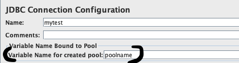
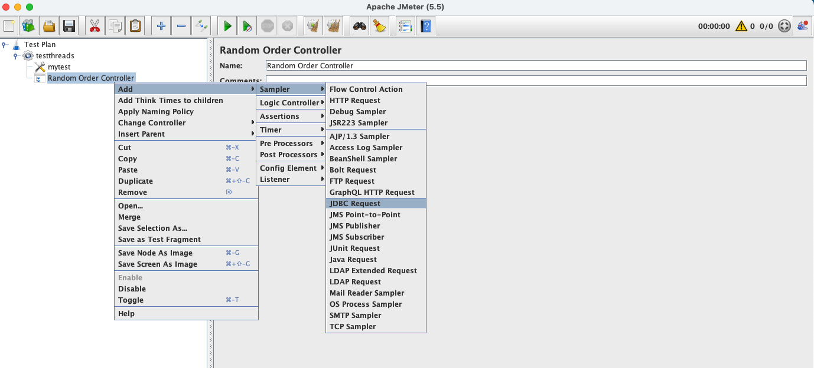

authors: Samuel Ehrlich & Brad Culderson
id: loadtesting_jmeter
summary: Load Testing in Snowflake
categories: Getting-Started
environments: web
status: draft 
feedback link: https://github.com/Snowflake-Labs/sfguides/issues
tags: Getting Started, Application Design, Load Testing 

# Load Testing in Snowflake and Using Query Acceleration Services
<!-- ------------------------ -->
## Overview 
Duration: 2

In this session we will cover how to perform load testing for your Data application workload using Jmeter.  Many organizations want to make sure their application or service can handle many users and many queries concurrently, with as little wait time as possible.  This guide will walk you through how you set up robust and accurate test to mimic a user experience.

### A word of caution

> aside positive
>
> This Quickstart guide is intended to the focus on strickly backend (i.e. Snowflake) Testing.  In addition, JMETER only focuses on a JDBC connector.  Other connectors have different capabilities and limitation and may skew results.  This guide is intended to focus on our java connector and executing queries against Snowflake.  You will need to validate end to end performance of your application if you want a jolistic view of your managed application.

### Prerequisites
- Have some general familiarity writing sql statements
- Basic knowledge of the snowflake patform
- A computer to install JMETER.  We will walk through installing JMETER, but it will be for a mac.

### What You’ll Learn 
- How to set up JMETER
- How to connect to snowflake from JMETER
- How to load sample data into snowflake
- How to run a series of load test in JMETER

<!-- ------------------------ -->

## Install JMETER
Duration: 10

- Download JMETER here:  http://jmeter.apache.org/download_jmeter.cgi
- Using a mac, download the .tgz which can be easily extracted

- Alternatively, you can a package manager like Brew to install JMETER.  For this guide, we use Brew.  Open your terminal and enter this command.

### Command line
```javascript
brew install jmeter
```

### Download the most recent JDBC driver for snowflake

- Download the most recent version of the JDBC Driver from the Maven Repository:  https://repo1.maven.org/maven2/net/snowflake/snowflake-jdbc/
- Download the snowflake-jdbc-#.#.#.jar file. (You do not need to download the entire directory.)
- Place the .jar file in the "libraries" directory under the main JMeter directory you created in the previous section

> aside negative
>
> NOTE if you are using brew, the jar file will put in a place similar to this: /opt/homebrew/Cellar/jmeter/5.5/libexec/lib

<!-- ------------------------ -->
## Using Test Data in Snowflake
Duration: 5

A single sfguide consists of multiple steps. These steps are defined in Markdown using Header 2 tag `##`. 

In this step you will pull in a large sample set of data from the snowflake marketplace.  Will be using Weather Source, LLC data in our example, but ultimately you should use your own data set for the most optimal testing.

### Browse to the Marketplace
Browse to the market place of your snowflake account.  If you don't have one yet, you can get started with a trial here:
[https://signup.snowflake.com/](https://signup.snowflake.com/)

You will need install this data set.  Simply click on the data and follow the steps.  It will available in your account immediately.

```markdown

Global Weather & Climate Data for BI

```


Now, this data should be queryable from your a worksheet inside of snowsight.


## Configuring JMETER
Duration: 20

Now, Let's open JMETER and head back to our terminal.  If you installed JMETER with brew, you should be able to just run:

### Command line
```javascript
jmeter
```
> aside negative
>
> NOTE: If this does not work, make sure add jmeter to your path variables.

Upon launching JMeter, you will be met with a blank Test Plan and WorkBench.  You should see this interface:


> aside positive
>
> In addition, we've included jmx file in the repository.  As a quick alternative, you can simply load that file, and replace the credentials.

Now we need to add elements to our test.

### 1. Start a Thread Group


### 2. Define the JDBC Connection


> aside negative
>
> NOTE: Note, it's very important to take note of what you call the "Variable Name for created Pool".  This will be used later on.




Database Connection Configuration – this is where you input your JDBC connection info

Database URL: jdbc:snowflake://<ACCOUNT>.<REGION>.snowflakecomputing.com/?db=<DATABASE>&schema=<SCHEMA>&warehouse=<WAREHOUSE>
JDBC Driver class: net.snowflake.client.jdbc.SnowflakeDriver
Username
Password


### 3. Add a Random Order Controller

This is what will tell JMeter to randomly select queries from a pool we will set up momentarily.


No additional configuration for this.

### 4. Now we need to add a query to this test



Add the pool name delcared in the JDBC Connection steps above.

Under "SQL Query", make sure "Query Type" is set to "Select Statement"

When adding your query make sure to wrap it with a "SELECT COUNT ( * ) FROM (...);"

The goal here is to make Snowflake do all the work required by the supplied query, but to not have the results of the test skewed by network time spent sending a huge result set across the wire

### 5. Lets add some "think" time to better mimic a user


NOTE: Set the delay to 3 seconds (3000 miliseconds)

### 6. Now, lets add some more random queries!

The quickest way to add more queries is typically to copy the first query, then paste it under the Random Order Controller several times.  This way, when you copy/paste, you will automatically create the Uniform Random Timers as well.

Your view should look something like this, with each query changed to random query.


### 7. The last item we need is a means to collect results

Add a View Results in table action.  


You can also add a View Results Tree if you want to do any trouble shooting


### Now we are ready to run some tests!

## Run your tests and view results

> aside negative
>
> NOTE: It's critical to turn off result set cache for your snowflake user.  This can be done on a snowflake worksheet.

```javascript
ALTER USER REPORTUSER SET USE_CACHED_RESULT = FALSE;
```

Click run at the top of the jmeter application.  Then you should see results start coming in.


## Review the query results in snowflake
Duration: 10

Click on query history in the activity pain your snowflake account.  You can see the results of the queries there:


## Enhancing performance with Query Acceleration Service (QAS)
Duration: 15

Query Acceleration Service is an incredible feature that allows Snowflake to intuitively scale your compute resources to a particular query.  Effectively, it will automatically recognize when a query could use additional compute power and auto provision.  You can read much more about the service in the docs: https://docs.snowflake.com/en/user-guide/query-acceleration-service

In this section we will walk through turning on Query Acceleration Service on a warehouse, and then seeing that impacts our load times.

For this example, I've turned off QAS to do my initial testing using a similar data set to what we've seen above.  

- Notice how each query takes roughly 22 seconds to execute against on 24GB of data.


Next, Lets turn on QAS for this warehouse:

```sql
alter warehouse main_wh set
  ENABLE_QUERY_ACCELERATION = true
  QUERY_ACCELERATION_MAX_SCALE_FACTOR = 100;
```
- Notice here, with QAS turned on, the system auto provisions additional compute for you.  Now the average query time is closer to about 15 seconds.


## Additional ways of Enhancing Performance
Duration: 5

There are many ways to improve performance in snowflake.  We cannot possibly cover all of the different scenarios in this guide.  A few that quickly come to mind are:

- Adding Clustering keys to your data
- Multi-cluster warehouses
> aside positive
>
> NOTE: One of the best ways to manage scalability is with MCW.  This will listen for any queueing going on within queries, and will auto scale your warehouse with the appropriate nodes.  This makes managing scalability very easy in Snowflake.  To learn more about this feature see this docs link: [https://docs.snowflake.com/en/user-guide/warehouses-multicluster](https://docs.snowflake.com/en/user-guide/warehouses-multicluster)

> aside positive
>
> NOTE: This is an enterprise feature

- Using Search optimization service
- Preaggrating certain repeatable results
- Using Materialized views
- Query Acceleration Service

Again, the list is too long to enumerate here, but please work with your account team to see what makes sense for your environment!

## Finish
Duration: 10

### What we've covered
- How to set up JMETER
- How to connect to snowflake from JMETER
- How to load sample data into snowflake
- How to run a series of load test in JMETER

### Call to Action
- The next step wou

We encourage you to do your own testing to see the power of your applications when they are built on top of the Snowflake Platform!
